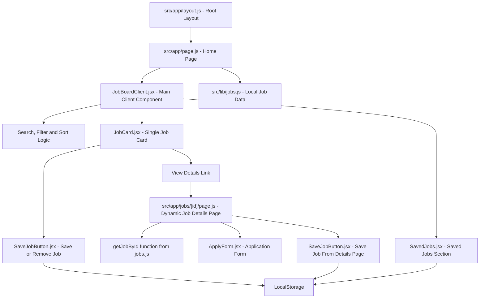
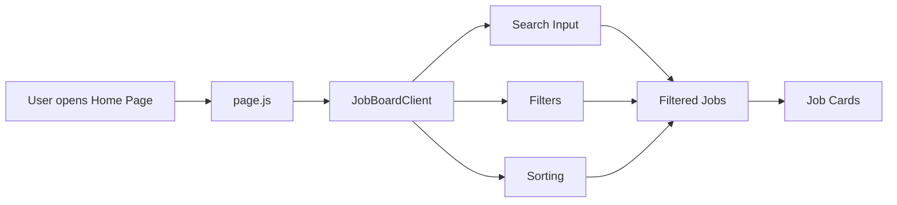
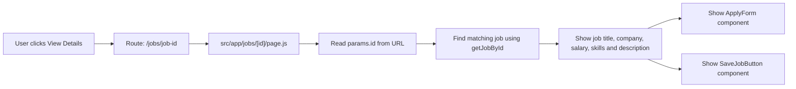
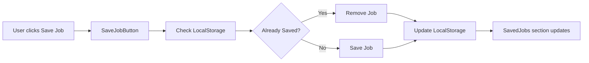

# JobBoard Pro - Next.js Job Board App

JobBoard Pro is a modern frontend job board application built with **Next.js App Router** and **React.js**.
Users can search jobs, filter jobs, sort jobs, view dynamic job details, save jobs in the browser, and submit a frontend-only application form.

---

## Live Demo

https://deshrajvermay9517-png.github.io/job-board-app/
---

## Features

* Job listing page
* Search jobs by title, company, or skills
* Filter jobs by location
* Filter jobs by category
* Filter jobs by job type
* Filter jobs by experience level
* Sort jobs by latest
* Sort jobs by salary
* Dynamic job details page
* Save jobs using LocalStorage
* Saved jobs section
* Frontend-only apply form
* Form validation
* Responsive design
* Dynamic metadata for job details pages

---

## Tech Stack

* Next.js
* React.js
* JavaScript
* CSS
* App Router
* LocalStorage

---

## Folder Structure

```text
src/
│
├── app/
│   ├── jobs/
│   │   └── [id]/
│   │       └── page.js
│   │
│   ├── layout.js
│   ├── page.js
│   └── globals.css
│
├── components/
│   ├── JobBoardClient.jsx
│   ├── JobCard.jsx
│   ├── SaveJobButton.jsx
│   ├── SavedJobs.jsx
│   └── ApplyForm.jsx
│
└── lib/
    └── jobs.js
```

---

## Project Architecture




---

## Project Workflow

### Home Page Flow



### Job Details Flow




### Saved Jobs Flow



---

## How This Project Works

The application is built using **Next.js App Router**.

`src/app/layout.js` is the root layout of the application. It imports the global CSS file and defines the global metadata.

`src/app/page.js` is the home page route. It imports job data from `src/lib/jobs.js` and passes that data to the `JobBoardClient` component.

`JobBoardClient.jsx` is the main interactive client component. It handles job search, filters, sorting, and displays the filtered job list.

`JobCard.jsx` displays a single job card with job title, company, location, salary, skills, and action buttons.

`SaveJobButton.jsx` allows users to save or remove jobs using browser LocalStorage.

`SavedJobs.jsx` displays all saved jobs from LocalStorage.

`src/app/jobs/[id]/page.js` is a dynamic route. It shows the full details of a selected job based on the job ID in the URL.

`ApplyForm.jsx` is a frontend-only application form with validation.

`src/lib/jobs.js` works as a temporary local data source for job listings.

---

## Server Components and Client Components

This project uses both **Server Components** and **Client Components**.

### Server Components

These files are Server Components by default:

```text
src/app/layout.js
src/app/page.js
src/app/jobs/[id]/page.js
```

Server Components are used for:

* Page structure
* Loading local job data
* Dynamic job details
* Metadata generation
* Static page generation

### Client Components

These files use browser-side interactivity:

```text
JobBoardClient.jsx
SaveJobButton.jsx
SavedJobs.jsx
ApplyForm.jsx
```

Client Components are used for:

* Search input
* Filters
* Sorting
* Button clicks
* Form handling
* LocalStorage
* Saved jobs
* Validation messages

---

## Next.js Concepts Used

* App Router
* `layout.js`
* `page.js`
* Dynamic routes using `[id]`
* `generateMetadata`
* `generateStaticParams`
* Server Components
* Client Components
* Static export support

---

## React Concepts Used

* Components
* Props
* useState
* useEffect
* useMemo
* Event handling
* Conditional rendering
* List rendering using `map`
* Form handling
* LocalStorage

---

## Run Locally

Clone the project:

```bash
git clone your-repository-link
```

Go to the project folder:

```bash
cd job-board-app
```

Install dependencies:

```bash
npm install
```

Run the development server:

```bash
npm run dev
```

Open the app in browser:

```text
http://localhost:3000
```

---

## Build Project

To create a production build:

```bash
npm run build
```

---


## Future Improvements

* Backend API routes
* Database integration
* Recruiter dashboard
* Candidate dashboard
* Authentication
* Real job application submission
* Resume upload
* Pagination
* Job posting form
* Email notifications
* Admin panel
* Search suggestions
* Dark mode

---

## Author

**Deshraj Verma**
B.Tech CSE Student | Software Developer | MERN & Next.js Learner
